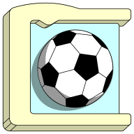
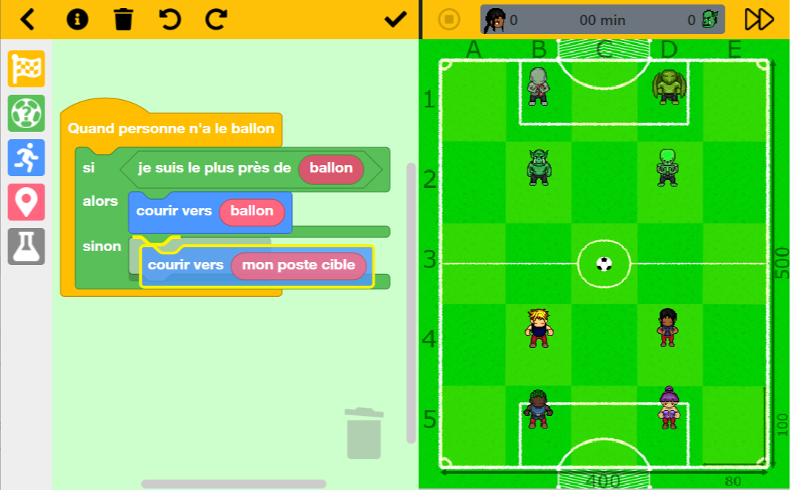

# SuperCodingBall (https://www.supercodingball.com)

*Read in [English](README.md).*

SuperCodingBall est un jeu éducatif gratuit, qui vise à faire découvrir la programmation, à travers le thème du football !

Le joueur va entraîner une équipe de 4 footballeurs (les humains) qui vont affronter 4 monstres.

La stratégie de l'équipe est faite avec des blocs (type [Scratch](https://scratch.mit.edu/projects/editor)),
ensuite le match se déroule automatiquement en suivant les stratégies des deux adversaires.

# Mobile

On peut jouer à SuperCodingBall sur un appareil mobile ou un ordinateur (dans ce cas, les blocs sont affichés à côté du terrain de foot).

Sur un appareil Android ou iOS, on peut installer l'application en tant que [PWA](https://web.dev/progressive-web-apps) (ça permet de pouvoir y jouer même sans connexion).

# Offline vs online

Il y a deux modes de jeu :
* le jeu local, contre l'ordinateur (avec quelques stratégies pré-définies)
* le jeu en ligne, contre d'autres joueurs (nécessite une connexion Internet)

Pour le jeu en ligne, SuperCodingBall utilise le service [Webcom](https://datasync.orange.com) pour stocker les informations des joueurs.
C'est un service réservé aux développeurs [Orange](https://www.orange.com), mais il peut être facilement remplacé par tout autre "Backend As a Service" (comme Firebase). 

Il y a 3 options pour se connecter :
* En tant qu'invité (ne permet pas d'utiliser plusieurs appareils)
* Avec un compte Facebook
* Avec un compte Google

Dans tous les cas, SuperCodingBall va stocker le pseudo (modifiable), les blocs et les résultats des matchs joués.

À tout moment, les joueurs peuvent supprimer leur compte.

## Blockly

SuperCodingBall utilise l'excellente bibliothèque [Blockly](https://developers.google.com/blockly) de Google pour gérer les interactions avec les blocs.

Pour générer les blocs personalisés, on peut utiliser les [Blockly Developer Tools](https://blockly-demo.appspot.com/static/demos/blockfactory/index.html), la source des blocs étant stockée [ici](./src/assets/blocks/library.xml).

Une fois le fichier [blocks.json](./src/assets/blocks/blocks.json) généré, il faut le modifier pour ajouter les styles et les traductions.

## Création des sprites

Tous les sprites des joueurs viennent "l'Open Game Art Liberated Pixel Cup" et ont été générés par [cet outil](https://github.com/sanderfrenken/Universal-LPC-Spritesheet-Character-Generator) :

* Guy 1: https://sanderfrenken.github.io/Universal-LPC-Spritesheet-Character-Generator/#?shoes=boots_brown1&hair=messy1_blonde&body=tanned&legs=pants_red&clothes=sleevless_blue
* Guy 2: https://sanderfrenken.github.io/Universal-LPC-Spritesheet-Character-Generator/#?shoes=boots_brown1&hair=bedhead_green&body=black&legs=pants_red&=eyes_brown&armor=chest_leather3
* Girl 1: https://sanderfrenken.github.io/Universal-LPC-Spritesheet-Character-Generator/#?sex=female&hair=ponytail2_black&clothes=sleeveless_blue&legs=pants_red&shoes=boots_brown1&body=brown&=eyes_brown
* Girl 2: https://sanderfrenken.github.io/Universal-LPC-Spritesheet-Character-Generator/#?sex=female&hair=tied_long_purple&clothes=corset_lavender&legs=pants_red&shoes=boots_brown1&body=peach&=eyes_brown
* Orc: https://sanderfrenken.github.io/Universal-LPC-Spritesheet-Character-Generator/#?body=orc3&legs=pants_black
* Reptile: https://sanderfrenken.github.io/Universal-LPC-Spritesheet-Character-Generator/#?shoes=boots_brown1&body=reptwings&legs=pants_green&=eyes_brown
* Skeleton: https://sanderfrenken.github.io/Universal-LPC-Spritesheet-Character-Generator/#?body=skeleton3
* Zombie: https://sanderfrenken.github.io/Universal-LPC-Spritesheet-Character-Generator/#?legs=pants_green&shoes=boots_brown1&body=zombie&ribs_blood=1&eyes=yellow

