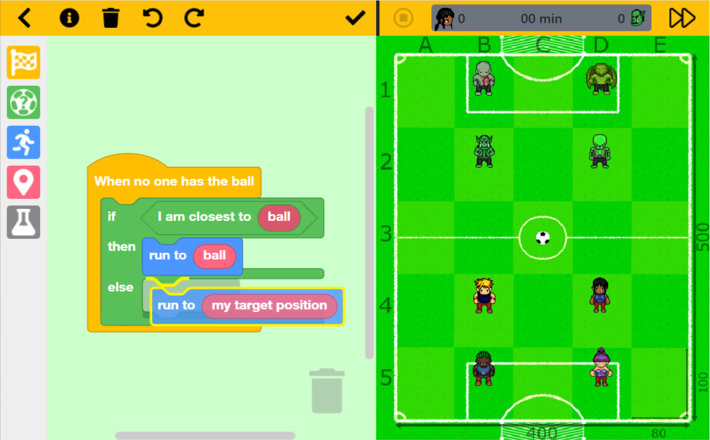

# SuperCodingBall (https://www.supercodingball.com)

*Lire en [français](README.fr.md).*

SuperCodingBall is a free educational game for 10+ years old children.

The goal is to discover programming with a football game! (it is a great way for teachers to introduce programming concepts)

The programming is done visually, like in [Scratch](https://scratch.mit.edu), but with fewer blocks (there is for example no "loops").

The player will train a team of 4 footballers 

who will face 4 monsters .

The team's strategy is built with blocks, then the game takes place automatically following the strategies of the two teams.

# Mobile

SuperCodingBall can be played on a mobile, tablet or a computer (in this case, the blocks are displayed next to the football field).

On an Android or iOS device, one can install the application as [PWA](https://web.dev/progressive-web-apps) (it allows to play even without connection).

# Offline vs online

There are two game modes:
* local play, against the computer (with some pre-defined strategies)
* online play, against other players (requires internet connection)

For online play, SuperCodingBall uses the [Webcom service](https://datasync.orange.com) to store player information.
This is a service reserved for [Orange](https://www.orange.com) developers, but it can be easily replaced by any other "Backend As a Service" (like Firebase).

There are 3 options to connect:
* As a guest (does not allow using multiple devices)
* With a Facebook account
* With a Google account

In all cases, SuperCodingBall will store the (modifiable) nickname, the blocks and the results of the games played.

At any time, players can delete their account.

## Blockly

SuperCodingBall uses Google's excellent [Blockly](https://developers.google.com/blockly) library to manage interactions with blocks.

To generate the personalized blocks, you can use the [Blockly Developer Tools](https://blockly-demo.appspot.com/static/demos/blockfactory/index.html), the source of the blocks being stored [here](./src/assets/blocks/library.xml).

Once the [blocks.json file](./src/assets/blocks/blocks.json) has been generated, it must be modified to add styles and translations.

## Sprites creation

All player sprites come from the "Open Game Art Liberated Pixel Cup" and were generated by [this tool](https://github.com/sanderfrenken/Universal-LPC-Spritesheet-Character-Generator):
* Guy 1: https://sanderfrenken.github.io/Universal-LPC-Spritesheet-Character-Generator/#?body=Humanlike_tanned&shoes=Shoes_brown&hair=Messy_blonde&legs=Pants_red&clothes=No_sleeves_blue
* Guy 2: https://sanderfrenken.github.io/Universal-LPC-Spritesheet-Character-Generator/#?body=Humanlike_black&shoes=Shoes_brown&hair=Cornrows_green&legs=Pants_red&eyes=Eyes_brown&armour=Leather_blue
* Girl 1: https://sanderfrenken.github.io/Universal-LPC-Spritesheet-Character-Generator/#?sex=female&body=Humanlike_brown&hair=Ponytail_2_black&clothes=Sleeveless_blue&legs=Pants_red&shoes=Shoes_brown&eyes=Eyes_brown
* Girl 2: https://sanderfrenken.github.io/Universal-LPC-Spritesheet-Character-Generator/#?sex=female&body=Humanlike_tanned_2&hair=Long_tied_purple&clothes=Corset_lavender&legs=Pants_red&shoes=Shoes_brown&eyes=Eyes_brown
* Orc: https://sanderfrenken.github.io/Universal-LPC-Spritesheet-Character-Generator/#?body=Orc_green_2&legs=Pantalons_black
* Reptile: https://sanderfrenken.github.io/Universal-LPC-Spritesheet-Character-Generator/#?body=Reptile_lightgreen_winged&legs=Pantalons_black
* Skeleton: https://sanderfrenken.github.io/Universal-LPC-Spritesheet-Character-Generator/#?body=Skeleton_green&legs=Pantalons_black
* Zombie: https://sanderfrenken.github.io/Universal-LPC-Spritesheet-Character-Generator/#?body=Humanlike_zombie&legs=Pantalons_black&wound_ribs=Ribs_ribs&eyes=Eyes_yellow

## Translations (for now English and French)

All translations are in the [i18n folder](./src/assets/i18n).

Feel free to contribute if you want to add another language!

## Genesis
SuperCodingBall has been created during an internal competition, but it is fully free, open source and without any ads.
